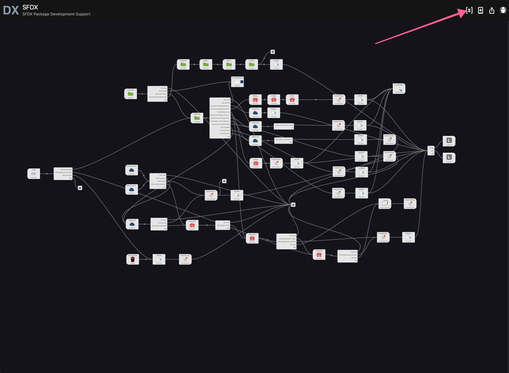
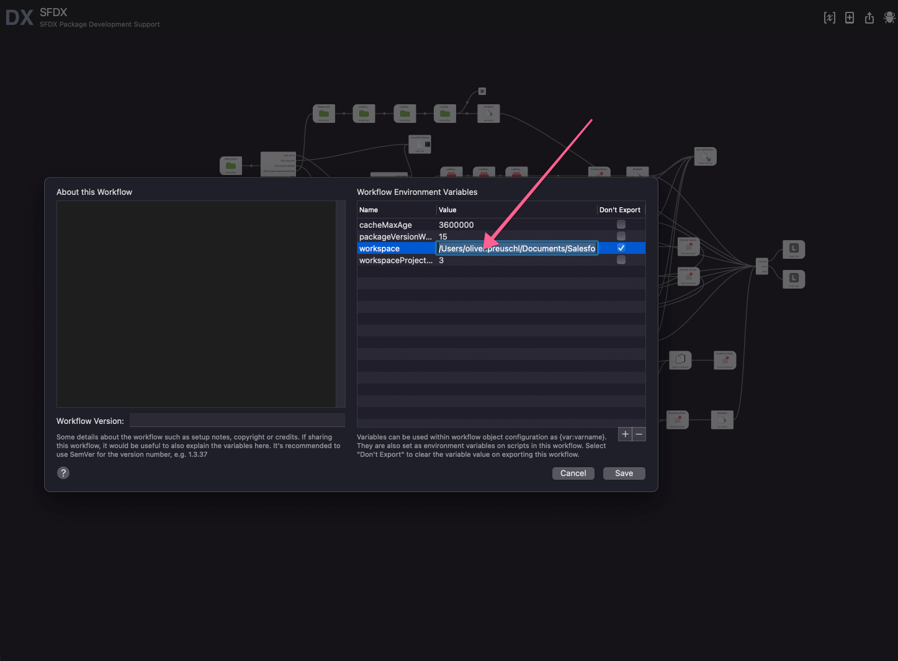

## About

Alfred 4 Workflow to simplify the development with SFDX.
The following features are supported:

- Projects
  - Display projects
  - Create new projects
  - Open project folder or file
  - Set default dev hub username
  - Create new scratch orgs (or link/unlink an existing one)
  - Packages
    - Display packages and versions with dependencies
    - Create packages (unlocked, unlocked org-dependent, managed)
    - Create package versions
    - Promote package versions
- Display and open scratch orgs and connected orgs and related packages

## Install

```
$ npm install --global alfred-sfdx
```

_Requires [Node.js](https://nodejs.org) 8+ and the Alfred [Powerpack](https://www.alfredapp.com/powerpack/)._

After installing the workflow you will have to set the environment variable "workspace" to the path where your SFDX projects are stored. This will make sure that your SFDX projects can be found. While this is the most important environment variable, there are a few more.

| Enironment Variable         | Description                                                                                                                                                                                                                                                                                                                                                                                      | Default Value                                                                                                                                                                |
| --------------------------- | :----------------------------------------------------------------------------------------------------------------------------------------------------------------------------------------------------------------------------------------------------------------------------------------------------------------------------------------------------------------------------------------------- | :--------------------------------------------------------------------------------------------------------------------------------------------------------------------------- |
| cacheMaxAge                 | alfred-sfdx caches some data like scratch orgs, packages and package versions. The cacheMaxAge specifies the number of milliseconds until the data gets refreshed. Besides that, the cache will get partially refreshed based on specific operations. For example: If you create a new scratch orgs, the scratch org cache will get deleted, to ensure that you will have access to the new org. | 3600000                                                                                                                                                                      |
| packageVersionWaitTime      | Specifies the number of minutes to wait for the package version creation command to complete.                                                                                                                                                                                                                                                                                                    | 15                                                                                                                                                                           |
| workspace                   | The path to the directory where you SFDX projects are located. alfred-afdx will search for potential SFDX project directories based the value of the environment variable "workspaceProjectSearchDepth"                                                                                                                                                                                          | This value will be empty after installation. You have to set it to gain access to this functionality. Please note, that it is not possible to use "~" in the workspace path. |
| workspaceProjectSearchDepth | Specifies how deep alfred-sfdx will search for potential SFDX project directories in your "workspace"                                                                                                                                                                                                                                                                                            | 3                                                                                                                                                                            |




Please refer to [the Alfred documentation](https://www.alfredapp.com/help/workflows/advanced/variables/) for more information about workflow variables.

## Usage

In Alfred, type `_sfdx`to get started with the workflow. The following screen cast will guide you through a typical package development process. Please keep in mind that some functionalities will get available by pressing the <kbd>crtl</kbd>, <kbd>alt</kbd> or <kbd>command</kbd> key.

